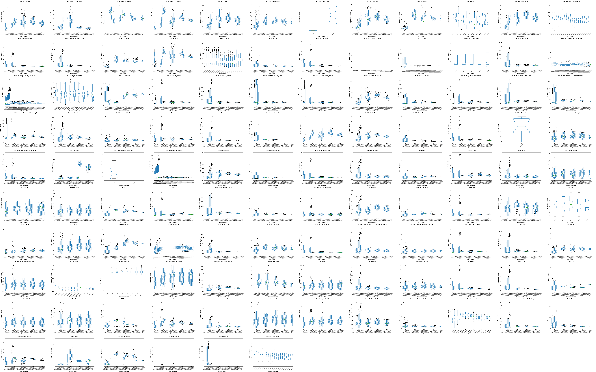
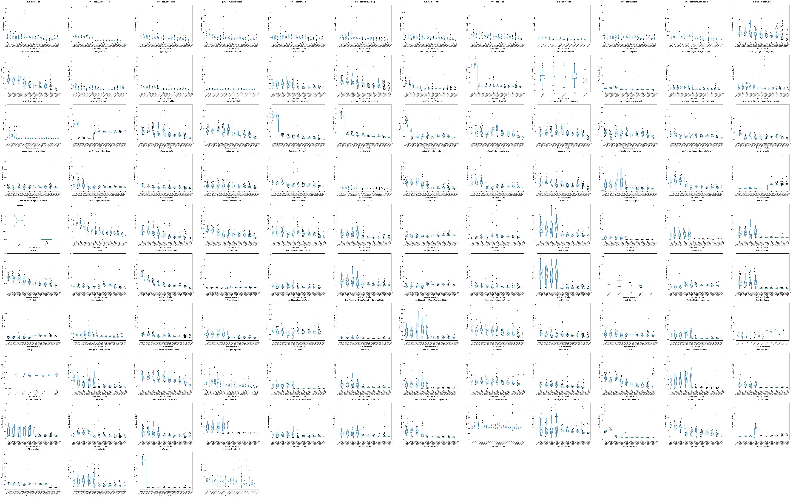

# OpenSim Travis Performance Measurements

A pipeline for scraping
[opensim-core](https://github.com/opensim-org/opensim-core/)
performance measurements from travis.

## Abstract

This repo contains the source code used to produce
[this](results/linux_all.png) montage that aggregates the time it took
Travis CI to run some of opensim-core's tests. Data between 01-01-2017
and 01-11-2020 was aggregated. We concluded that the data mined this
way was noisy and that we should develop a dedicated performance
benchmark (which became
[osimperf](https://github.com/adamkewley/osimperf)). This repo, and
the measurements, are uploaded here for completeness, rather than
usefulness.


## All Plots

- Linux



- OSX




## Overview

[opensim-core](https://github.com/opensim-org/opensim-core/) is a
large (>150 kLOC), long-term (>10 year), expert-level, simulation
codebase with many (>40) contributors from a variety of
backgrounds. Because the project is large, and contributors may be
working on entirely different subsystems, performance regressions can
gradually be introduced over time.

The aim of this work was to use the data we already have (travis CI
builds) to identify long-term performance changes in OpenSim. The main
advantage of this approach is that the project already has over 15k
travis (sub-)builds available online. That is quite a bit of data -
all of which is from clean (CI) builds of
[opensim-core](https://github.com/opensim-org/opensim-core/). Any
*large* changes in performance over time should be clearly visible
from these measurements.

The approach has two primary disadvantages, though:

- **Build log data is "as-is"**. Any useful information must be
  extracted out of what was frozen in the build logs. If those logs do
  not contain a valuable performance metrics (generally, they don't)
  then related metrics were used (e.g. how long a test takes to
  run). We may be able to add basic performance measurements into the
  build, but that will (obviously) only affect *future* build logs.

- **Precise, long-term performance metrics are difficult to achieve in
  travis**: Travis does not guarantee that a build runs on
  well-defined, dedicated hardware. Travis is a cloud service. It
  *may* be running on a distributed cluster of virtual machines, or a
  docker container on a dedicated machine. Accurate long-term
  performance measurements may be impacted by changes in
  infrastructure, VM scheduling, etc.

So scraping travis logs gives us a high-level, rough, view of
performance trends in
[opensim-core](https://github.com/opensim-org/opensim-core/) over
time. Please keep this in mind when trying out this pipeline or
viewing the results.

This investigation prompted us to write
[osimperf](https://github.com/adamkewley/osimperf), a dedicated
performance measurement suite for OpenSim that is focused on producing
a lower-level, precise, way of measuring the performance of OpenSim
simulations. That approach produces more accurate measurements but
requires re-building historical commits and recording the data. This
requires sampling the commits (rebuilding + re-measuring >15k builds
would be prohibatively expensive).


## Experimental

- Historical build logs for
  [opensim-core](https://github.com/opensim-org/opensim-core/) were
  downloaded from travis for all builds, including sub-builds
  (e.g. OSX, Linux, gcc, clang)

- Unit test durations were extracted from the logs using regex. The
  extracted times were aggregated, with no modification, to the output
  dataset

- The dataset was plotted using matplotlib. Modifications/cleanups
  (see `analysis` script):

  - Only data after 2017-01-01 is plotted. This is because earlier CI
    runs do not contain test suite timings

  - Only tests for which there are >32 timings available are
    plotted. This filters out tests that only have an extremely small
    amount of data (e.g. tests that have not been running for years)
 
 
## Discussion

- Data yielded from this process was extremely noisy - probably
  because of the underlying infrastructure (a distributed VM) and
  might be impacted by parallel test execution (in-VM test thread
  contention)
  
- No particularly meaningful conclusions can be drawn from this
  dataset. Some test plots seemed to contain interesting trends, but
  most of these trends are smaller than the noise of the measurement
  and do not account for hardware changes.
  
- The only meaningful performance regression that the analysis
  identified was in `testDataTable`. This requires further
  investigation, but it must be noted that actual end-user simulations
  are not particularly impacted by data table overhead, so it is
  unlikely that "fixing" this regression (if there is one: it could be
  test additions) would do much


## Conclusions

A pipeline was developed for pulling and mining all of
[opensim-core](https://github.com/opensim-org/opensim-core/)'s travis
build logs. While this pipeline could be used for other analyses
(build times, commit frequency, etc.) the primary analysis
(performance) yields results which are not useful.


# Building

This is only necessary if you want to gather the raw + process the
data yourself. Because build logs are immutable, processing the data
from travis *should* result in exactly the same plots. We have backed
up the raw data + intermediates and can provide them if requested.

Requires:

 - **For data aggregation**: `make`, `travis` (CLI), `grep`, `xargs`, `python3`, `cut`
 - **For analysis + plotting**: `make`, `python3`, `pandas` (python3
   lib), `matplotlib` (python3 lib)
 - **For tiling analyses into single motage image**: `montage` (from `imgmagick`)

```bash
#!/usr/bin/env bash

# see: Makefile for detailed step-by-step explanation

# fetch opensim-core build history from travis
make history.txt

# explode history into individual ID files (for incremental building, etc.)
make ids

# aggregate all subbuilds into a single CSV (for later analysis)
make subbuild.csv

# explode subbuild IDs into individual ID files
make subbuild_ids

# fetch subbuild logs from travis
make subbuild_logs

# scrape the logs for test run-times
make subbuild_test_durations.csv

# aggregate all data into a single CSV
make final_test_timings.csv

# analyze + plot + montage the data
make analyze
```

Note:

- It's not a single-step build because some of the steps (e.g. `make
  history.txt`) can't cache (because they're from travis) and the main
  rate-limiter when working with this pipeline is incremental rebuilds
  (e.g. for weekly re-analysis)

- The pipeline is implemented using `make` /w ID files, rather than as
  an all-in-one script because incremental rebuilds and the ability to
  cancel + resume the build midway is quite important
